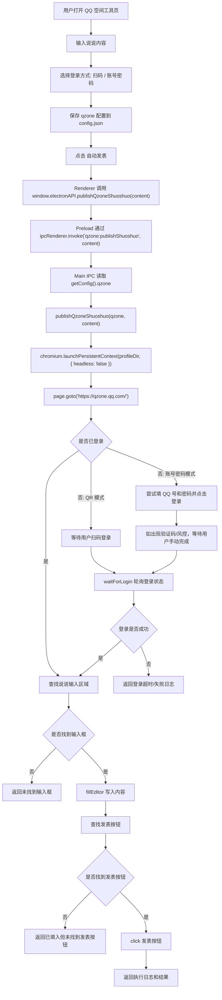
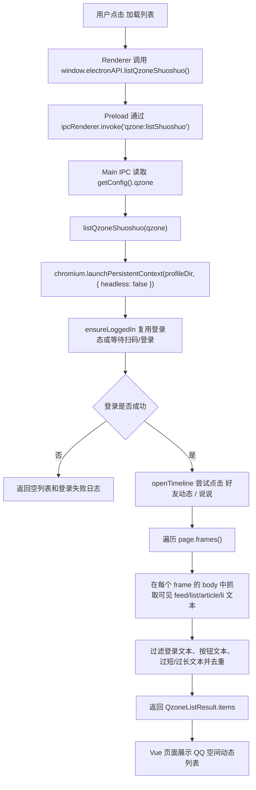
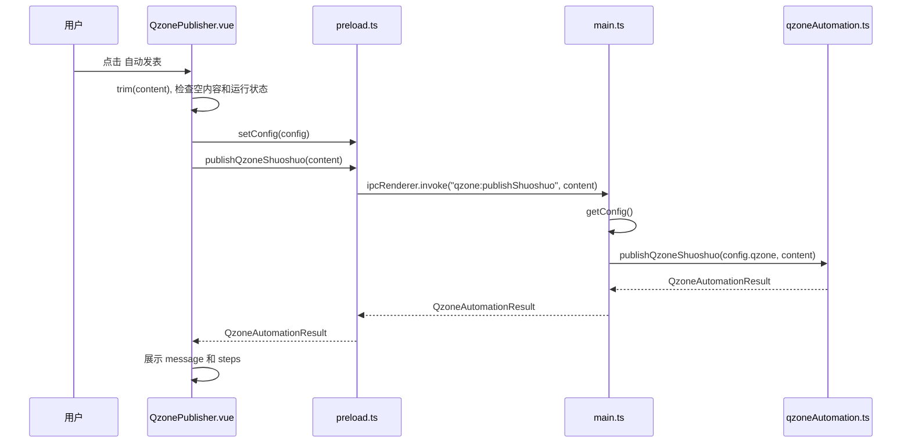

# QQ 空间说说自动发表流程说明

本文档记录 `avan-toolkit` 中 QQ 空间说说自动发表工具的当前实现流程、关键库调用、数据流、已知问题和后续调试方向。

## 功能目标

- 在应用内提供一个 QQ 空间说说发布工具页。
- 用户输入说说内容后，主进程通过 Playwright 打开 QQ 空间。
- 支持扫码登录，也支持预配置 QQ 号和密码后尝试自动登录。
- 登录成功后查找说说输入区域，填入内容，并点击发表。
- 登录成功后也可以复用同一份 Playwright 登录态，抓取 QQ 空间页面中的可见动态并展示在应用内部列表中。
- 不绕过验证码、滑块、短信、风控或二次安全验证；这些场景需要用户在弹出的 Playwright 浏览器窗口中手动完成。

## 相关文件

- 前端页面：`src/views/QzonePublisher.vue`
- preload 暴露：`src/preload.ts`
- Electron API 类型：`src/electron-api.d.ts`
- 主进程 IPC：`src/main.ts`
- 配置管理：`src/main/configManager.ts`
- 自动化核心：`src/main/qzoneAutomation.ts`
- Playwright 打包 external 配置：`vite.main.config.mts`
- 依赖和浏览器安装脚本：`package.json`

## 端到端流程图



## 列表加载流程图



## 前端调用链

### 页面状态

`src/views/QzonePublisher.vue` 维护这些主要状态：

- `config.qzone.loginMode`: 登录方式，`qr` 或 `credentials`。
- `config.qzone.qqNumber`: QQ 号。
- `config.qzone.qqPassword`: QQ 密码，当前按初版方案明文保存到本地配置文件。
- `config.qzone.playwrightProfileDir`: Playwright persistent context 的用户数据目录。
- `content`: 用户输入的说说内容。
- `running`: 是否正在发表。
- `testingLogin`: 是否正在测试登录。
- `result`: 主进程返回的执行结果和步骤日志。

### 发布动作



## 主进程 IPC

`src/main.ts` 新增两个 IPC：

- `qzone:testLogin`
  - 读取 `getConfig().qzone`
  - 调用 `testQzoneLogin(config.qzone)`
  - 只验证登录，不发表内容
- `qzone:publishShuoshuo`
  - 读取 `getConfig().qzone`
  - 调用 `publishQzoneShuoshuo(config.qzone, content)`
  - 完成登录检测、内容填入和发表点击
- `qzone:listShuoshuo`
  - 读取 `getConfig().qzone`
  - 调用 `listQzoneShuoshuo(config.qzone)`
  - 复用登录态进入 QQ 空间，抓取可见动态文本并返回给页面展示

## Playwright 核心调用

### 启动浏览器并持久化登录态

自动化入口通过 `runWithContext` 包裹：

```ts
chromium.launchPersistentContext(qzone.playwrightProfileDir, {
  headless: false,
  viewport: { width: 1280, height: 860 },
});
```

关键点：

- 使用 `launchPersistentContext` 而不是普通 `launch`，目的是保存 QQ 登录 cookie、localStorage 等状态。
- `qzone.playwrightProfileDir` 默认在 Electron `userData/qzone-playwright-profile`。
- `headless: false`，因为扫码、验证码、滑块和风控都需要用户看到浏览器窗口。
- 运行前必须安装 Playwright Chromium：

```bash
npm run install:playwright
```

### 打开 QQ 空间

```ts
page.goto('https://qzone.qq.com/', {
  waitUntil: 'domcontentloaded',
  timeout: 60_000,
});
```

当前没有调用 QQ 空间非公开发布接口，只做页面自动化。

## 登录流程

### 登录状态检测

`hasLoggedInSignal(page)` 用两组候选信号判断是否登录：

- 未登录信号：
  - 登录 iframe：`iframe[id*="login"]`
  - 登录 iframe 地址包含：`xui.ptlogin2.qq.com`
  - 页面文本：`扫码登录`、`帐号密码登录`、`账号密码登录`、`QQ帐号`、`QQ账号`
- 已登录信号：
  - `#QM_OwnerInfo_Icon`
  - `.user-home`
  - `.head-avatar`
  - `[data-clicklog*="profile"]`
  - 页面文本：`说说`、`好友动态`、`个人档`、`日志`

### 扫码登录

当 `loginMode === 'qr'`：

1. 打开 QQ 空间。
2. 如果没有登录，保留 Playwright 浏览器窗口。
3. 用户扫码。
4. `waitForLogin` 每 1.5 秒轮询一次登录状态，最多等待 180 秒。

### 账号密码登录

当 `loginMode === 'credentials'`：

1. 遍历 `page.frames()`。
2. 尝试点击 `帐号密码登录` / `账号密码登录` / `密码登录`。
3. 查找账号输入框：
   - `input[name="u"]`
   - `input[id="u"]`
   - placeholder 匹配 `QQ号码|QQ号|账号|帐号`
   - 任意 `input[type="text"]`
4. 查找密码输入框：
   - `input[name="p"]`
   - `input[id="p"]`
   - `input[type="password"]`
   - placeholder 匹配 `密码`
5. 调用 `locator.fill(...)` 填入 QQ 号和密码。
6. 查找并点击登录按钮。
7. 如果出现验证码、滑块、短信、扫码或风控，等待用户手动完成。

## 发表流程

### 查找说说输入区域

`focusShuoshuoEditor(page, steps)` 先直接查找输入区域：

```ts
frame.locator('.qz-poster-editor-cont .qz-inputer [contenteditable="true"]:visible')
frame.locator('.qz-poster-editor-cont [id$="_substitutor_content"]:visible')
frame.locator('.qz-poster-editor-cont [id$="_content_content"]:visible')
frame.locator('textarea')
frame.locator('[contenteditable="true"]')
frame.locator('[role="textbox"]')
frame.getByPlaceholder(/说点什么|发表|分享|动态|心情|what/i)
```

根据手动登录后观察到的 QQ 空间 DOM，优先使用 `.qz-poster-editor-cont` 容器内的可见 `contenteditable`。这样可以避开评论框、搜索框、其他模块编辑器等非发表区域。

如果直接找不到，再尝试点击入口：

```ts
frame.getByText(/说说|写说说|发表说说|分享新鲜事/)
frame.locator('a:has-text("说说")')
frame.locator('button:has-text("说说")')
```

然后再次查找输入区域。

### 填入内容

`fillEditor(editor, content)` 优先使用：

```ts
editor.click()
editor.fill(content)
```

如果目标不是标准 input/textarea，Playwright `fill` 可能失败，此时降级为：

```ts
editor.click()
editor.evaluate((node) => {
  // 清空 value 或 textContent
  // 派发 input/change 事件
})
editor.pressSequentially(content)
```

降级路径使用 `pressSequentially`，目的是让 QQ 空间旧版 contenteditable 编辑器收到更接近真实键盘输入的事件。

### 点击发表

发表按钮候选：

```ts
frame.locator('.qz-poster-ft .btn-post:visible')
frame.locator('[data-hottag="MOODPOSTER.POST"]:visible')
frame.locator('.op .btn-post:visible')
frame.getByRole('button', { name: /发表|发布|发送|post|publish/i })
frame.locator('button:has-text("发表")')
frame.locator('a:has-text("发表")')
frame.locator('[role="button"]:has-text("发表")')
```

根据 QQ 空间 DOM，发表按钮位于 `.qz-poster-ft` 下，核心按钮是 `.btn-post`，并带有 `data-hottag="MOODPOSTER.POST"`。

找到后调用：

```ts
publishButton.click()
```

## 列表展示流程

前端点击“加载列表”后调用：

```ts
window.electronAPI.listQzoneShuoshuo()
```

主进程返回：

```ts
interface QzoneListItem {
  id: string;
  text: string;
  source: string;
}

interface QzoneListResult extends QzoneAutomationResult {
  items: QzoneListItem[];
}
```

自动化侧流程：

1. 使用 `launchPersistentContext` 打开同一个 `playwrightProfileDir`。
2. 调用 `ensureLoggedIn`，优先复用已保存的登录态。
3. 尝试点击 `好友动态` 或 `说说` 入口。
4. 遍历 `page.frames()`，在每个 frame 的 `body` 中抓取候选动态节点。
5. 候选节点包括 `.f-single`、`.feed`、`.feed-item`、`.list_item`、`[data-feedid]`、`article`、`li` 等。
6. 过滤登录相关文本、按钮文本、过短/过长文本，并去重。
7. 最多返回 20 条，展示在 `QzonePublisher.vue` 的“QQ 空间动态列表”区域。

当前列表抓取仍是页面级 scraping，不是 QQ 空间官方 API；如果 QQ 页面结构变化，可能需要继续收窄 selector。

## 当前已知问题：输入位置不对

你当前观察到的现象是：扫码登录、输入内容这部分流程基本跑通，但内容写入的位置不正确。

旧实现中最可能原因是 `frameTextCandidates` 太宽泛：

```ts
frame.locator('textarea')
frame.locator('[contenteditable="true"]')
frame.locator('[role="textbox"]')
```

这会导致 Playwright 找到页面中第一个可见的 `textarea`、`contenteditable` 或 textbox，而这个元素可能不是 QQ 空间顶部的说说发表框。它可能是：

- 评论输入框
- 搜索框
- 隐藏面板里的编辑器
- iframe 中其他模块的输入区域
- QQ 空间页面加载后的某个默认可见编辑器

当前实现已按你提供的 DOM 优先定位：

```ts
.qz-poster-editor-cont .qz-inputer [contenteditable="true"]:visible
.qz-poster-editor-cont [id$="_substitutor_content"]:visible
.qz-poster-ft .btn-post:visible
[data-hottag="MOODPOSTER.POST"]:visible
```

当前 `findVisibleInFrames` 也是按 `page.frames()` 顺序遍历，找到第一个可见候选就返回：

```ts
for (const frame of page.frames()) {
  const locator = await firstVisibleLocator(createCandidates(frame), timeout);
  if (locator) {
    return locator;
  }
}
```

所以一旦某个非发表框先被匹配，就会出现“流程大概对，但输入位置不对”。

## 后续修正方向

### 方向一：先点击明确的“说说/分享”入口，再限定输入框作用域

更稳的方式不是全页面找第一个输入框，而是：

1. 找到发表说说入口。
2. 点击入口。
3. 等待发表区域或弹窗出现。
4. 在这个区域内找输入框。

也就是从“全局找输入框”改为“先找容器，再在容器内找输入框”。

### 方向二：记录候选元素调试信息

可以临时增加调试日志，输出每个候选输入框的：

- frame URL
- tagName
- id
- className
- placeholder
- aria-label
- inner text 前 50 字
- bounding box

这样可以定位当前到底写进了哪个元素。

### 方向三：使用截图和 DOM 快照辅助修选择器

在登录成功、准备输入前添加：

```ts
await page.screenshot({ path: 'qzone-before-fill.png', fullPage: true });
```

并在候选输入框附近打框或打印 bounding box，用于确认 Playwright 选中的元素位置。

### 方向四：针对 QQ 空间实际 DOM 补更窄的选择器

登录后手动检查页面 DOM，找到说说发表框附近稳定特征，再把候选顺序调整为：

1. QQ 空间说说发表区域的专属 selector。
2. 该区域内的 contenteditable/editor。
3. 最后才 fallback 到通用 `textarea` / `[contenteditable=true]`。

## 错误处理边界

当前实现会返回 `QzoneAutomationResult`：

```ts
interface QzoneAutomationResult {
  success: boolean;
  message: string;
  steps: string[];
}
```

典型失败场景：

- Playwright 浏览器未安装。
- QQ 空间登录超时。
- 找不到账号密码输入框。
- 找不到说说输入框。
- 找不到发表按钮。
- QQ 空间页面被风控、验证码、短信或滑块拦截。

这些场景不会让应用崩溃，主进程会把错误转换成 `message` 和 `steps` 返回给前端页面展示。

## 打包相关

Playwright 和 `fsevents` 不能被 Vite 主进程 bundle 直接吞进去，否则会出现原生 `.node` 文件解析错误。

因此 `vite.main.config.mts` 中 external 了：

```ts
external: [
  'playwright',
  'playwright-core',
  'fsevents',
]
```

这表示运行时由 Node/Electron 加载这些包，而不是由 Rollup 打包解析它们。

## 当前验证状态

- `npm run install:playwright` 已用于安装 Chromium。
- `npm run package` 可以通过。
- 自动化流程已能看到扫码登录和输入动作。
- 当前主要待修问题是：输入框定位过宽，导致内容写入位置不稳定。
